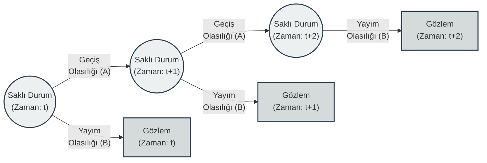
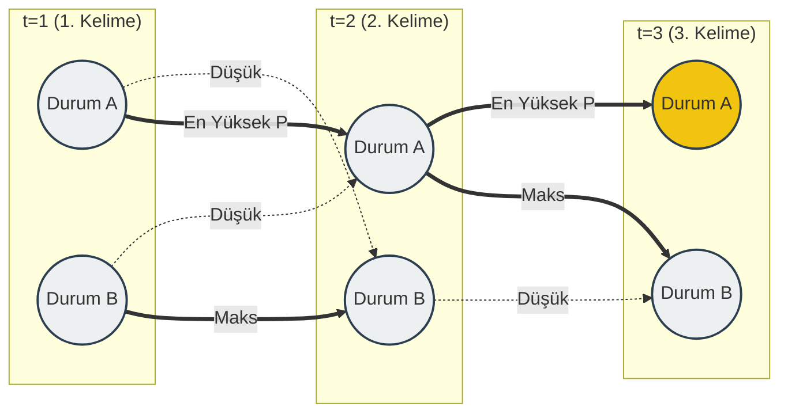
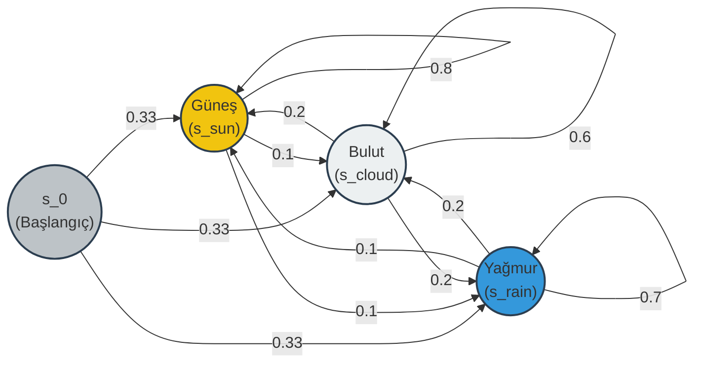

# Saklı Markov Modelleri (Hidden Markov Models - HMM)

Gençler, sistemlerin veya süreçlerin anlık durumlarını her zaman doğrudan ölçemeyiz. Bazen asıl ilgilendiğimiz yapı, doğrudan gözlemleyebildiğimiz verilerin arkasına gizlenmiştir. Doğal dil işleme (Natural Language Processing - NLP) çalışmalarında, örneğin bir SMS metninin içindeki kelimelerin dizilimine bakarak o mesajın dolandırıcılık amacı taşıyıp taşımadığını anladığımız süreci düşünün. Mesajın kendisi gözlemlediğimiz veridir, mesajı yazanın asıl niyeti ise saklı durumdur.

Bir arkadaşınızın uzaktaki bir şehirde yaşadığını varsayın. Arkadaşınızla sadece mesajlaşıyorsunuz ve size o gün ne yaptığını söylüyor: Ya kitap okuyor, ya yürüyüşe çıkıyor ya da evde temizlik yapıyor. Siz ise o şehrin hava durumunu merak ediyorsunuz. Hava durumunu doğrudan göremiyorsunuz, bu sizin için **Saklı Durum** (Hidden State). Durum kelimesinin İngilizcesi olan *state*, Latince *status* (durma, pozisyon, vaziyet) kökünden gelir. Sistemin içinde bulunduğu vaziyeti ifade eder.

Arkadaşınızın size bildirdiği günlük aktiviteler ise sizin **Gözlem**inizdir (Observation). Gözlem kelimesi Latince *observare* (dikkatle bakmak, gözetlemek) fiiline dayanır. Elimizde sadece bu gözetlediğimiz veriler vardır.

Arkadaşınızın güneşli günlerde yürüyüşe çıkma ihtimalinin, yağmurlu günlerde ise evde kitap okuma ihtimalinin daha yüksek olduğunu biliyorsunuz. Aynı zamanda o şehirde güneşli bir günden sonraki günün de güneşli olma ihtimalinin yüksek olduğunu biliyorsunuz. İşte elinizdeki bu sınırlı mesajlardan yola çıkarak, "Dün kitap okudu, bugün temizlik yaptı, demek ki dünden beri hava büyük ihtimalle yağmurlu" şeklinde geriye dönük yaptığınız çıkarım, zihninizde çalışan bir dizilim modelidir.

Bu mantıksal sürecin matematiğe dökülmüş haline **Saklı Markov Modeli** (Hidden Markov Model - HMM) diyoruz. Adını Rus matematikçi Andrey Markov'dan alır. Markov'un kurduğu yapının en temel prensibi şudur: Bir sistemin gelecekteki durumu, sadece ve sadece onun şu anki durumuna bağlıdır. Tüm geçmişin veri yükünü hafızada taşımamıza gerek yoktur. Buna Markov Özelliği (Markov Property) denir.

Aşağıdaki şemada bu yapının zaman içindeki ilerleyişini görebilirsiniz:

Bir sistemin arka plandaki bu ağ yapısını bilgisayarlara anlatmak ve hesaplanabilir hale getirmek için matrisleri kullanırız. Bir HMM temel olarak üç ana parametre ile tanımlanır ve genellikle $\lambda = (A, B, \pi)$ şeklinde gösterilir.

**1. A Matrisi (Geçiş Olasılıkları - Transition Probabilities):** Sistemin bir saklı durumdan diğerine geçme ihtimallerini barındırır. "Bugün güneşliyse yarın da güneşli olma ihtimali nedir?" veya mekansal-zamansal (spatio-temporal) bir veride "Sistem $S_1$ durumundan $S_2$ durumuna hangi olasılıkla geçer?" sorularının matematiksel karşılığıdır.

**2. B Matrisi (Yayım Olasılıkları - Emission Probabilities):** İngilizcedeki *emission* kelimesi Latince *emittere* (dışarı salmak, yaymak) kökünden gelir. Belirli bir saklı durumdayken, sistemin belirli bir gözlemi dışarı yayma ihtimalini ifade eder. "Hava yağmurluyken arkadaşımın kitap okuma ihtimali nedir?" sorusu bu matrisin içindeki bir değerdir.

**3. $\pi$ Vektörü (Başlangıç Olasılıkları - Initial Probabilities):** Süreci gözlemlemeye başladığımız o ilk anda ($t=1$), sistemin hangi saklı durumda olduğuna dair elimizdeki başlangıç olasılık dağılımıdır.

Bu modeli kurduğumuzda, veri madenciliği süreçlerinde genellikle karşımıza çıkan üç temel problemi çözebiliriz:

* **Değerlendirme (Evaluation):** Elimizde bir model ($\lambda$) ve peş peşe dizilmiş bir gözlem dizisi var. Kurduğumuz bu modelin, elimizdeki bu gözlem dizisini üretme olasılığı nedir? Bu problemi çözmek için İleri (Forward) algoritmasını kullanırız.
* **Şifre Çözme (Decoding):** Elimizde yine gözlemler var ve biz bu gözlemleri üreten en olası *saklı durum dizisini* bulmak istiyoruz. Bir cümlede arka arkaya dizilmiş kelimelerin isim mi, fiil mi, sıfat mı (Part-of-Speech Tagging) olduğunu sırasıyla bulmak tam olarak bu problemdir. Burada devreye Viterbi Algoritması girer ve tüm olasılık ağacını hesaplamak yerine en güçlü yolu bulur.
* **Öğrenme (Learning):** Elimizde sadece saf gözlemler var. Sistemi en iyi tanımlayacak olan $A$, $B$ ve $\pi$ parametrelerini, yani modelin kendisini bu veriden öğrenmek istiyoruz. Bu durumda Baum-Welch algoritması gibi yöntemlerle parametrelerimizi optimize ederiz.

Bu algoritmalar içinden özellikle saklı durumların şifresini çözmemizi sağlayan Viterbi algoritmasının nasıl çalıştığına bakalım. 

Saklı Markov Modellerinde (Hidden Markov Model - HMM) arka planda işleyen yapıyı anladıktan sonra, asıl mesele elimizdeki kısıtlı verilere bakarak o gizli yapının şifresini çözmektir. Bu şifre çözme işlemini bizim için yapan temel yaklaşıma Viterbi Algoritması diyoruz. 

Doğal dil işleme (Natural Language Processing - NLP) modellerinde analiz edilen bir metni düşünün. Örneğin cep telefonunuza gelen şüpheli bir SMS mesajını inceliyoruz. Mesajdaki kelimeler sırasıyla akıyor: "Hemen", "tıklayın", "kazanın". Bu kelimeler bizim gözlemleyebildiğimiz verilerdir. Arka planda ise bu kelime dizilimini üreten asıl niyet, yani metnin "Normal" mi yoksa "Dolandırıcılık" (Fraud) amaçlı mı olduğu gibi saklı durumlar (hidden states) yer alır. Amacımız, sadece okuduğumuz bu kelimelere bakarak, arka planda işleyen en olası durumlar zincirini ortaya çıkarmaktır.

Eğer analiz ettiğimiz mesaj 20 kelimelikse ve arka planda 3 farklı saklı durum ihtimali varsa, toplamda $3^{20}$ farklı olası yol ortaya çıkar. Kelime sayısı arttıkça tüm bu ihtimalleri tek tek hesaplamak bilgisayarların işlemci gücünü aşar.

İşte bu noktada Andrew Viterbi'nin geliştirdiği algoritma devreye girer. Bu algoritma, bilgisayar bilimlerinde Dinamik Programlama (Dynamic Programming) dediğimiz bir temel üzerine inşa edilmiştir. Dinamik kelimesi, Yunanca *dunamis* (güç, hareket) kökünden gelir ve baştan sona sabit bir planı takip etmek yerine, ilerledikçe eldeki yeni verilere göre kendini uyarlayan sistemleri ifade eder. 

Süreci zihnimizde somutlaştırmak için karmaşık bir şehirde A noktasından B noktasına gitmeye çalışan bir kurye olduğunuzu varsayın. Şehirde binlerce farklı ara sokak ve rota seçeneği vardır. Kurye her yeni kavşağa geldiğinde, başlangıç noktasından itibaren olabilecek bütün alternatif yolları hafızasında tutmaya çalışmaz. Bunun yerine sadece şu hesabı yapar: "Bu kavşağa ulaşabileceğim en hızlı ve en olası yol hangisiydi?" O kavşağa gelen diğer tüm yavaş yolları tamamen unutur. Bir sonraki kavşağa ilerlerken de sadece bu "en iyi" ara yolların üzerine hesaplama yapar. Viterbi algoritması da tam olarak bu mantıkla, gereksiz hesaplama yükünden kurtularak ilerler.

Bu yapının zaman içindeki akışını genellikle İngilizcede kafes anlamına gelen *Trellis* diyagramları ile çizeriz.

İşin hesaplama kısmına geçtiğimizde, gençler, bu kurye mantığını matrislere dökeriz. Zamanı $t$ ile, bulunduğumuz saklı durumu ise $k$ ile ifade edelim. Her $t$ anında ve her $k$ durumu için, o noktaya kadar gelen en olası yolun olasılık değerini hesaplar ve bu değeri $V_{t,k}$ değişkeninde tutarız.

Adım adım ilerlerken kullandığımız temel matematiksel bağıntı şudur:

$$
V_{t, k} = \max_{x \in S} (V_{t-1, x} \cdot A_{x, k} \cdot B_{k, o_t})
$$

Bu denklemde gördüğümüz değişkenlerin her biri, sistemin geçmişten bugüne taşıdığı bir bilgiyi temsil eder:

* $V_{t-1, x}$: Bir önceki zaman adımında ($t-1$), $x$ durumunda olmanın hesaplanmış en yüksek olasılığıdır. Kuryenin bir önceki kavşağa ulaşma süresi gibi düşünebilirsiniz.
* $A_{x, k}$: Sistemin $x$ durumundan $k$ durumuna Geçiş Olasılığı (Transition Probability).
* $B_{k, o_t}$: Sistem $k$ durumundayken, elimizdeki o anki $o_t$ verisini (örneğin mesajdaki o kelimeyi) Yayım Olasılığı (Emission Probability).

Denklemdeki $\max$ fonksiyonu çok kritiktir. Algoritma, bulunduğumuz $k$ durumuna gelebilecek tüm geçmiş $x$ durumlarını tek tek bu çarpımdan geçirir ve sadece olasılığı en yüksek olanı ($max$) seçip $V_{t, k}$ olarak kaydeder. Diğer zayıf ihtimaller o anda çöpe atılır. 

Zaman çizelgesinin en sonuna, yani analiz ettiğimiz verinin son anına ($T$) ulaştığımızda elimizde farklı durumlar için nihai $V_{T}$ değerleri kalır. Bu değerler arasından en büyüğünü seçeriz. Daha sonra, "Ben bu en yüksek olasılıklı sonuca hangi kavşaklardan geçerek ulaştım?" diyerek sistemi geriye doğru takip ederiz. Bu işleme Geriye İz Sürme (Backtracking) adı verilir. 

İşte bu geriye doğru takip işlemi bittiğinde, elimizdeki karmaşık gözlem dizisini üreten en mantıklı, matematiksel olarak kanıtlanmış o saklı durumlar dizisini baştan sona elde etmiş oluruz. Doğal dil işleme algoritmalarından gen dizilimlerinin analizine kadar birçok alanda karşımıza çıkan gürültülü ve belirsiz veriler, bu yöntemle anlamlı yapılara dönüştürülür.

Saklı Markov Modelleri (Hidden Markov Models - HMM) üzerine konuşurken, arka planda işleyen zaman serilerini ve durum geçişlerini iyi anlamamız gerekir. Bir sistemi incelerken, bu sistemin içinde bulunabileceği bir dizi durumu (state) göz önüne alırız ve bunu $S = \{s_1, s_2, ... s_{|S|}\}$ şeklinde ifade ederiz. İngilizcedeki *state* (durum) kelimesi Latince *status* kökünden gelir ve sistemin o anki pozisyonunu veya halini belirtir. Bu durumları zaman içinde ardışık bir dizi olarak gözlemleyebiliriz. Gözlemlerimizin kümesini $\vec{z} \in S^T$ olarak tanımlıyoruz.

Örneğin, dışarıdaki hava durumunu modelliyor olalım. Havanın alabileceği durumlar kümemiz $S = \{sun, cloud, rain\}$ olsun. Burada toplam durum sayımız |S| = 3'tür. Birkaç günlük bir periyotta havayı gözlemlediğimizi düşünün. Beş günlük ($T=5$) bir gözlem dizimiz şu şekilde olabilir: $\{z_1 = s_{sun}, z_2 = s_{cloud}, z_3 = s_{cloud}, z_4 = s_{rain}, z_5 = s_{cloud}\}$.

Hava örneğimizdeki bu gözlemlenen haller, aslında zaman içinde işleyen rastgele bir sürecin çıktısını temsil eder. Normal şartlar altında, dışarıdan başka hiçbir varsayım eklemediğimizde, $t$ zamanındaki hava durumu ($s_j$), $1$'den $t-1$'e kadar olan tüm geçmiş durumların bir fonksiyonu olabilir. Hatta modellemediğimiz pek çok değişken de bu süreci etkileyebilir. Eğer bugünkü havanın durumunu tahmin etmek için dünyanın varoluşundan bugüne kadarki tüm hava olaylarını hesaba katmak zorunda kalsaydık, hiçbir sistem bu hesabı yapamazdı.

Gençler, zaman serileri hakkında izlenebilir ve hesaplanabilir şekilde akıl yürütmemize izin veren iki temel Markov varsayımı kullanırız.

Birincisi, Sınırlı Görüş Varsayımıdır (Limited Horizon Assumption). Bu kural bize, $t$ zamanında belirli bir durumda olma olasılığımızın sadece $t-1$ zamanındaki duruma bağlı olduğunu söyler. Bu varsayımın altında yatan temel mantık oldukça sadedir: $t$ zamanındaki durum, sistemin gelecek durumunu tahmin etmek için geçmişin yeterli bir özeti ile temsil edilmesidir. Geçmişe dair tüm veri yükünü sırtımızda taşımayız. Matematiksel olarak bunu şu şekilde yazarız: 

$$
P(z_t | z_{t-1}, z_{t-2}, ..., z_1) = P(z_t | z_{t-1})
$$

İkincisi ise Durağan Süreç Varsayımıdır (The Stationary Process Assumption). Durağan kelimesi, Latince *stationarius* (sabit, değişmez) kökünden gelir. Bu varsayım, bir sonraki duruma geçerken mevcut durumun sağladığı koşullu dağılımın zaman içinde değişmediğini ifade eder. Yani "güneşli bir günden sonra yağmur yağma ihtimali", bugün hesaplasak da on gün sonra hesaplasak da sistemimizde aynı kabul edilir. Formülize edersek: 

$$
P(z_t | z_{t-1}) = P(z_2 | z_1); t \in 2...T
$$

Sistemi başlatmak için bir ilk durum ve ilk gözlem tanımlamamız gerekir, bunu $z_0 \equiv s_0$ olarak varsayıyoruz. Buradaki $s_0$, $0$ zamanında sistemdeki durumlar üzerindeki başlangıç olasılık dağılımını temsil eder. Bu notasyonel kolaylık, sistemin ilk gerçek durumu olan $z_1$'i $P(z_1 | z_0)$ olarak görme olasılığına ilişkin inancımızı kodlamamızı sağlar. Böylece dizilimi baştan sona $P(z_t|z_{t-1},...,z_1) = P(z_t|z_{t-1},...,z_1, z_0)$ şeklinde ifade edebiliriz.

Şimdi bu olasılıkları sistemli bir şekilde yapılandırmamız gerekiyor. Bunun için Geçiş Matrisi (Transition Matrix) kullanırız ve bunu $A$ ile gösteririz. Boyutları $\mathbb{R}^{(|S|+1) \times (|S|+1)}$ şeklindedir. $+1$ eklememizin sebebi, sisteme dahil ettiğimiz başlangıç durumu olan $s_0$'dır. Matrisin içindeki her bir $A_{ij}$ değeri, sistemin herhangi bir $t$ zamanında $i$ durumundan $j$ durumuna geçiş olasılığıdır.

Güneş, bulut ve yağmur içeren modelimiz için geçiş matrisimizi sayısal değerlerle kuralım.

İlk durumumuz olan $s_0$'dan havanın diğer üç durumuna (güneş, bulut, yağmur) geçiş için eşit (uniform) bir olasılık dağılımı gösterdiğini varsayıyoruz. Bu olasılıklar $0.33$, $0.33$ ve $0.33$ şeklindedir.

Sonrasında sistemin kendi içindeki geçişlerine bakalım:
* Güneşli ($s_{sun}$) bir günden sonra tekrar güneşli olma olasılığı $0.8$, bulutlu ($s_{cloud}$) olma olasılığı $0.1$, yağmurlu ($s_{rain}$) olma olasılığı ise $0.1$'dir.
* Bulutlu ($s_{cloud}$) bir günden sonra güneşli olma ihtimali $0.2$, tekrar bulutlu olma ihtimali $0.6$, yağmurlu olma ihtimali ise $0.2$'dir.
* Yağmurlu ($s_{rain}$) bir günden sonra havanın açıp güneşli olma ihtimali $0.1$, bulutlu olma ihtimali $0.2$ ve yağmurlu kalma ihtimali $0.7$'dir.

Bu sistemi bir diyagram üzerinde inceleyelim:

Oluşturduğumuz matriste ve diyagramda dikkat ederseniz, havanın kendi kendisiyle ilişkili (self-correlated) olduğu sezgisini temsil eden sayılar vardır. Güneşliyse güneşli kalma eğilimindedir, bulutluysa bulutlu kalır. Bu örüntü, birçok Markov modelinde yaygındır ve geçiş matrisinde güçlü bir köşegen (diyagonal) yapı olarak gözlemlenebilir. Olayların birbiri ardına dizilişindeki bu eğilimler, veri analizi süreçlerinin ve algoritma tasarımlarının temel taşıdır.

Bu durum geçişlerinin matematiksel modellemesi ile ilgili sormak veya hesaplamak istediğiniz başka bir adım var mı?